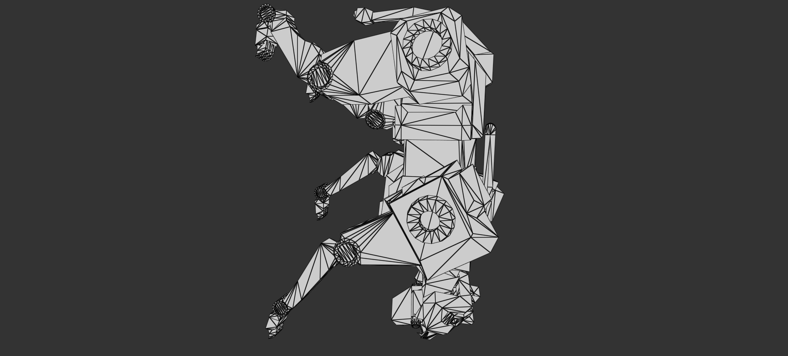
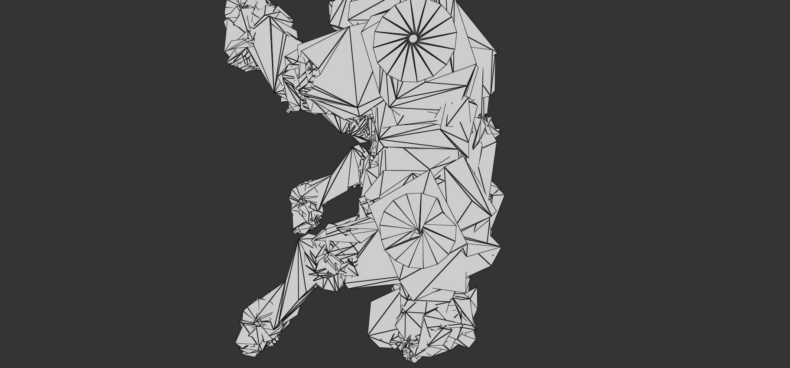
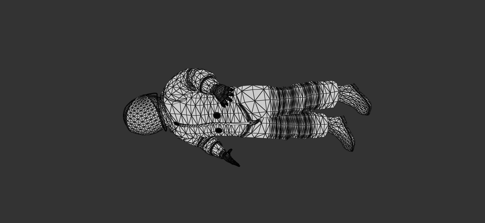
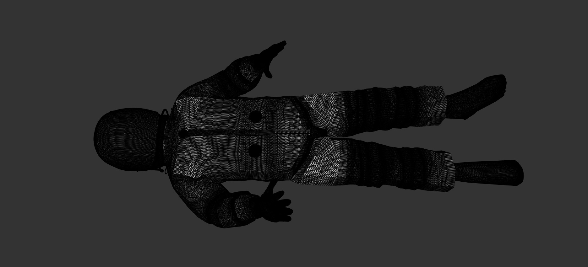
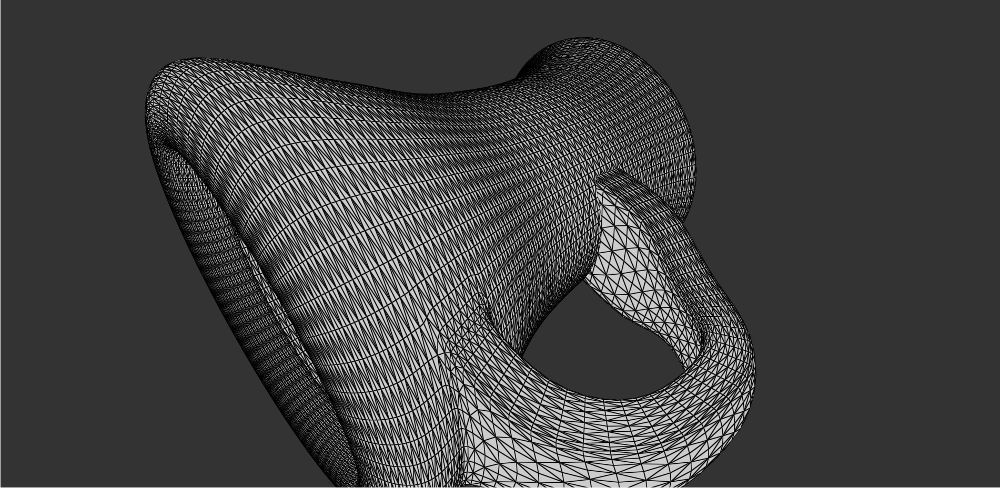
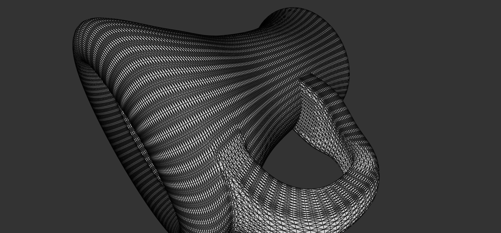
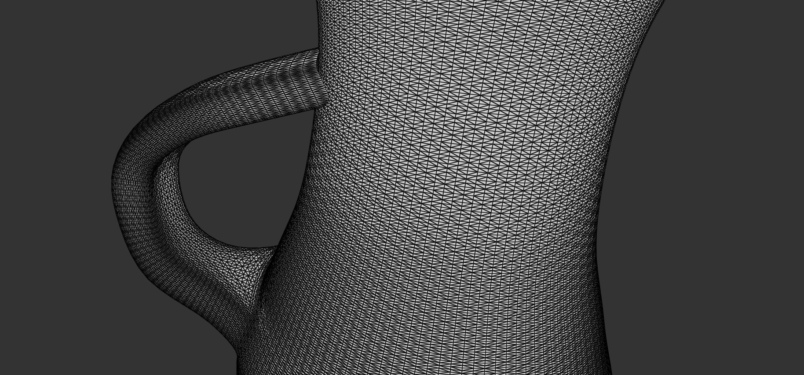

Authors - Mikhail Sorokin and Ruoyu Lei

Programming Assignment 3: Mesh Processing
----------
#### The following methods are implemented:

1. [Analysis](#analysis)
2. [Warps](#warps)
3. [Smooth](#smooth)
4. [Sharpen](#sharpen)
5. [Split Faces](#split)
6. [Split Long Edges](#long)
7. [Subdivision](#subdiv)
8. [BONUS](#bonus)

# Analysis

The analysis is with the normal function calculations and average edge length calculations.

First, the mesh structures were updated in Mesh_Face and Mesh_Vertex. Additionally, Mesh_Edge was added for average edge calculations.
``` 
struct Mesh_Face {
    Mesh_Face() {
        vert[0] = vert[1] = vert[2] = -1;
    }

    Mesh_Face(long v0, long v1, long v2) {
        vert[0] = v0; vert[1] = v1; vert[2] = v2;
    }
    long vert[3]; // indices (in the vertex array) of all vertices (mesh_vertex)
    QVector3D faceNormal;
};


struct Mesh_Edge {

    Mesh_Edge(int start, int end) {
        startVertexID = start;
        endVertexID = end;
    }
    int startVertexID;
    int endVertexID;
};


struct Mesh_Vertex {

    Mesh_Vertex(float x, float y, float z) {
        position = QVector3D(x,y,z);
    }
    QVector3D position;
    float avgEdgeLength;
    QVector3D normal;

    vector<Mesh_Edge> edges;
};
``` 

Next, the mesh struct was updated to reflect these changes, and to calculate normals a 2D vector was added for calculating normal adjacencies.
``` 
struct Mesh {
    vector<Mesh_Face> faces; // Mesh faces.
    vector<Mesh_Vertex> vertices; //Mesh Vertices
    vector<vector<Mesh_Face>> facesAdjVertex; //Faces connected to a vertex
    ...
    ...
}
``` 

This section is used in Warps, and all of the other methods below. Thus, their uses will be discussed further there.

# Warps

Inflate was implemented using the average length of edges and the normals to move each vertex
up by that amount.
Inflate BEFORE:


Inflate AFTER doing following factors on sphere.obj:

``` 
inflate 5.0
inflate -5.0
inflate 6.0
``` 


Random Noise was implemented using a random seed for the factors and every vertex is also moved in a random direction by the normal values.
Random Noise BEFORE:


Random Noise AFTER doing following factors on iron_man.obj:

``` 
Random Noise 3.0
``` 


# Smooth

Smooth was implemented using the calculated normals of the vertices, in which
every vertex was shifted by a position relative to its own normal vector in the 
direction opposite of the inflation method.
Smooth BEFORE:


Smooth AFTER on Car.obj:


# Sharpen

Sharpen was implemented using [insert here]
Sharpen was implemented using a similar approch as smooth.

To find the sharpend position v` for every vertex v, we take the following steps:

1. find vertex g as if we run smooth on v

2. get d = g - v
        
3. get d` = d / ||d||. d divided by its norm
        
4. get d`` = - d`. Reverse the direction of d`.
        
5. v` = v + d`` * esp. Epsilon is a factor that determines "how far" we want to go on the direction of d``

In regards to epsilon, we figured out that there is not a universal one that works perfectly well on very mesh. Instead, the value the epsilon depends on the nature of the mesh.

For some rounded meshes, even a large epsilon wouldn't affect it too much. For example, eps ∈ [0.05, 0.2]

For some very sharp meshes, we have to use a relatively smaller epsilon to not destroy the overall shape of the original mesh. eps ∈ [0.03, 0.07]

Sharpen BEFORE:


Sharpen AFTER on Lion.obj:



# Split

Split Faces was implemented using [insert here]
Split Faces BEFORE:


Split_Faces AFTER on acesjustforroomshow.obj:


Split_Faces multiple times AFTER on acesjustforroomshow.obj to really see the splitting happening dramatically:



# Long

Long split edges was implemented using [insert here]
Split long edges was implemented using the following steps:

1. Get the average edge length and time 4/3. This is the threshold.

2. Run a helper function to determine if there is any edge in the mesh that is long that the threshold. If there is any, then: 

3. Create midpoint vertices on those long edges. Connect the newly created vertex with the start and end point of the edge, and connect the two points on the edge with the midpoint vertex too.

4. Go through all faces that have long edges (we keep track of them when we run the check in step 2) and connect the midpoint vertex with the thrid point in the face and vice versa.

5. Create 2 new faces and remove the original face.

6. Check again if there's long edges in the mesh. If there is any, start from step 3 all over again. Otherwise, the function is finished.

Long split edges BEFORE:


Long split edges AFTER on Lion.obj:



# Subdiv

Subdivision was implemented using the split_faces method.
Loop subdivision is implemented with the help of split_faces function. 
It first run the split_faces and then update the position of all vertices.

For all even vertices, namely vertices whose indices range from 0 to the original size of the vertices vector - 1, use the even weights.
For all odd vertices, namely vertices whose indices range from the original size of the vertices vector to the new size of the vertices vector, use the odd weights.

After loop subdivision, the topology remains the same but the geometry is different since the positions of vertices have been updated.

Subdivision BEFORE:


Subdivision AFTER on Lion.obj:



# BONUS

(MAYBE) TO BE DONE 