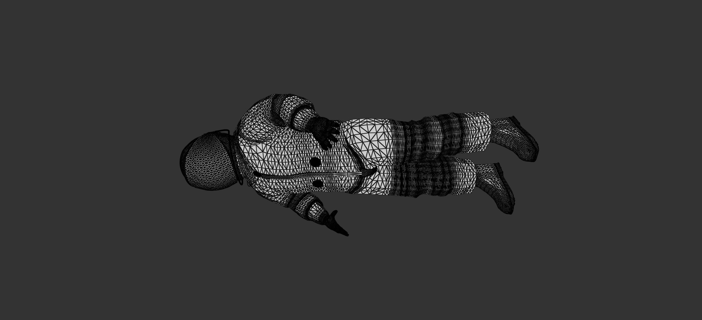

Authors - Mikhail Sorokin and Ruoyu Lei

Programming Assignment 3: Mesh Processing
----------
#### The following methods are implemented:

1. [Analysis](#analysis)
2. [Warps](#warps)
3. [Smooth](#smooth)
4. [Sharpen](#sharpen)
5. [Split faces](#split)
6. [Collapse short edges](#collapse)
7. [Subdivision](#subdiv)
8. [BONUS](#bonus)

# Analysis

The analysis is with the normal function calculations and average edge length calculations.

First, the mesh structures were updated in Mesh_Face and Mesh_Vertex. Additionally, Mesh_Edge was added for average edge calculations.
``` 
struct Mesh_Face {
    Mesh_Face() {
        vert[0] = vert[1] = vert[2] = -1;
    }

    Mesh_Face(long v0, long v1, long v2) {
        vert[0] = v0; vert[1] = v1; vert[2] = v2;
    }
    long vert[3]; // indices (in the vertex array) of all vertices (mesh_vertex)
    QVector3D faceNormal;
};


struct Mesh_Edge {

    Mesh_Edge(int start, int end) {
        startVertexID = start;
        endVertexID = end;
    }
    int startVertexID;
    int endVertexID;
};


struct Mesh_Vertex {

    Mesh_Vertex(float x, float y, float z) {
        position = QVector3D(x,y,z);
    }
    QVector3D position;
    float avgEdgeLength;
    QVector3D normal;

    vector<Mesh_Edge> edges;
};
``` 

Next, the mesh struct was updated to reflect these changes, and to calculate normals a 2D vector was added for calculating normal adjacencies.
``` 
struct Mesh {
    vector<Mesh_Face> faces; // Mesh faces.
    vector<Mesh_Vertex> vertices; //Mesh Vertices
    vector<vector<Mesh_Face>> facesAdjVertex; //Faces connected to a vertex
    ...
    ...
}
``` 

This section is used in Warps, and all of the other methods below. Thus, their uses will be discussed further there.

# Warps

Inflate was implemented using the average length of edges and the normals to move each vertex
up by that amount.
Inflate BEFORE:


Inflate AFTER doing following factors on sphere.obj:

``` 
inflate 5.0
inflate -5.0
inflate 6.0
``` 


Random Noise was implemented using a random seed for the factors and every vertex is also moved in a random direction by the normal values.
Random Noise BEFORE:


Random Noise AFTER doing following factors on iron_man.obj:

``` 
Random Noise 3.0
``` 


# Smooth

Smooth was implemented using the calculated normals of the vertices, in which
every vertex was shifted by a position relative to its own normal vector in the 
direction opposite of the inflation method.
Smooth BEFORE:


Smooth AFTER on Car.obj:


# Sharpen

Sharpen was implemented using [insert here]
Sharpen BEFORE:


Sharpen AFTER on Lion.obj:


# Split

Split was implemented using [insert here]
Split BEFORE:


Split AFTER on Lion.obj:



# Collapse

Collapse was implemented using [insert here]
Collapse BEFORE:


Split AFTER on Lion.obj:


# Subdiv

Subdivision was implemented using the split_faces method.
Subdivision BEFORE:


Subdivision AFTER on Lion.obj:


# BONUS

(MAYBE) TO BE DONE 
